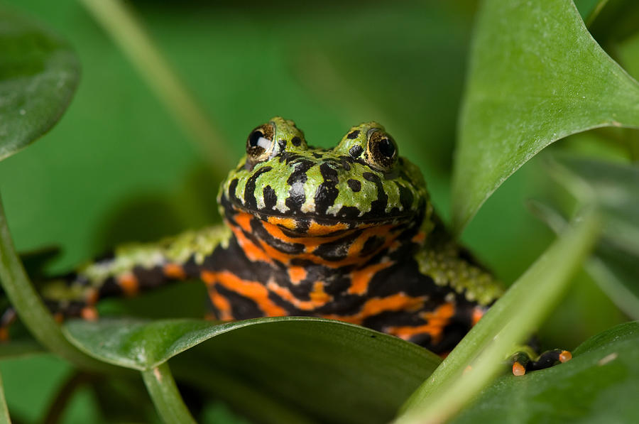
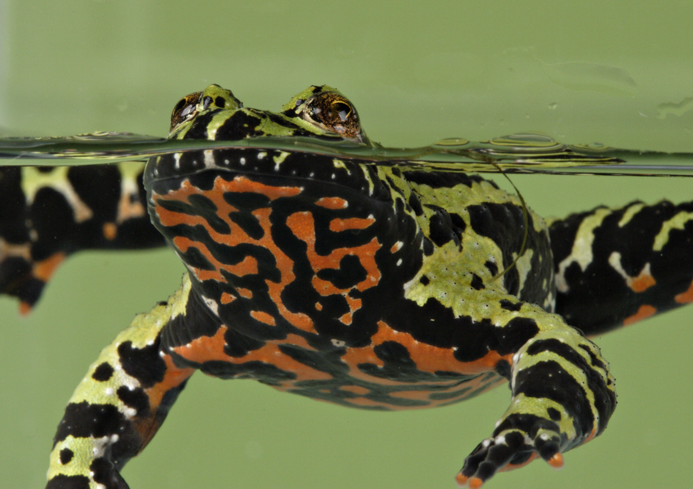

##Amphibians and Pesticides: A Study on the Effects of Sublethal Atrazine Exposure on Embryonic and Larval Growth and Development

By Claire Brumbaugh-Smith

on May 13, 2015

<center>\center


## Global Amphibian Decline
>- As of 1993, 500 amphibian species were listed worldwide as declining or of concern (Vial et al.)
>- Increased ultraviolet radiation, predation, habitat modification, acidity and toxicants, diseases, climate/weather (Alford et al., 1999) 
>- Metastudy: populations have been experiencing decline since the 1950s. (Houlahan et al., 2000)

## Global Amphibian Decline: Since the 1950s

<center>\center

##Pesticide Use
>- Modern industrial agriculture most rapid change in land use practices (Matson et al., 1997)
>- Increase production of corn from 7 to 14 million bushels 
>- Decrease of arable land from 20.6% to 17% (NASS, 2014; WB, 2015)
>- Sublethal concentrations became lethal to amphibians when coupled with other stressors (Relyea et al., 2003, Davidson et al., 2007)

##Atrazine Use
>- Most commonly used herbicide in the U.S. with approximately 76.4 million pounds applied annually  (ATSDR, 2003)
>- Functions as an herbicide by inhibiting the electron transport system necessary for photosynthesis (Allen, 1983)
>- EPA set maximum contaminant level  of atrazine to 3 ppb (EPA IRED, 2003)
>- Banned in Europe in 2004 (EPA RED, 2006)

##Atrazine Biology

<center>\center

>- 480 ppb in streams and lakes and 40 ppb in precipitation during large rain events (Hayes et al., 2002; Huber et al., 1993)
>- found far away from agricultural application: the atmosphere, ice, fog, and seawater (Goolsby et al., 1997; Hernyak et al., 1996)
  
Heavy use and environmental persistence has made atrazine the number one herbicide found in fresh water in the US (Gilliom, 1999).
 
 ##Maternal Transfer
>- Direct Effects
>- Indirect Effects

##Frog Lifecyle

<center>\center

##Environmental Persistence

<center>\center

##Model Species: Bombina Orientalis
<center>\center

##Model Species: Bombina Orientalis
Why Bombina?

>- Atrazine not widely applied in their native range
>- Hardy lab specimens, easy to breed

##Experimental Design
>- 0, 0.1, 1, 10, and 100 ppb atrazine tested
>- Mothers exposed to chemical grade atrazine for 15 weeks
>- Embryos placed in commercial grade atrazine
>- Data collected daily for 2 weeks
>-  

##Statistical Methods
>- Account for Pseduoreplication
>- Two way analysis of variance 


##Ambient Atrazine Exposure
```{r, echo=FALSE, warning=FALSE, message=FALSE}
library(ggplot2)
library(dplyr)
library(ggthemes)
library(ellipse)

aae <- read.csv("AAE.csv", header=TRUE,  stringsAsFactors = FALSE) %>% tbl_df()


y.choices <- c("Stage.at.Hatching", "Days.to.Hatching", "SVL.at.Hatching", "Stage.at.Death", "Days.to.Death")

library(shiny)

shinyApp(
  ui = fluidPage(
   selectInput("yaxisvar", label = "Response Variable:",
              choices = y.choices,
              selected = "SVL.at.Day.3",
              multiple = FALSE),
   plotOutput("RV")
),
server = function(input, output) {
  output$RV <- renderPlot({
  y.variable <- input$yaxisvar
  
aae <- aae %>%
       mutate_(x="Ambient.Atrazine.Exposure",
               y=y.variable)
  
ggplot(data=aae, aes(x=x, y=y)) + 
       geom_line() + 
       scale_x_log10(name="Atrazine Concentration (ppb)") + 
       scale_y_continuous(name=y.variable) +
       theme_bw()
})
},
options = list(height = 500)
)
```

##Maternal Atrazine Exposure
```{r, echo=FALSE, warning=FALSE, message=FALSE}
library(ggplot2)
library(dplyr)
library(ggthemes)
library(ellipse)

mae <- read.csv("MAE.csv", header=TRUE,  stringsAsFactors = FALSE) %>% tbl_df()


y.choices <- c("Stage.at.Hatching", "Days.to.Hatching", "SVL.at.Hatching", "Stage.at.Death", "Days.to.Death")

library(shiny)

shinyApp(
  ui = fluidPage(
   selectInput("yaxisvar", label = "Response Variable:",
              choices = y.choices,
              selected = "SVL.at.Day.3",
              multiple = FALSE),
   plotOutput("RV")
),
server = function(input, output) {
  output$RV <- renderPlot({
  y.variable <- input$yaxisvar
  
mae <- mae %>%
       mutate_(x="Maternal.Atrazine.Exposure",
               y=y.variable)
  
ggplot(data=mae, aes(x=x, y=y)) + 
       geom_line() + 
       scale_x_log10(name="Atrazine Concentration (ppb)") + 
       scale_y_continuous(name=y.variable) +
       theme_bw()
})
},
options = list(height = 500)
)
```

## Slide with Plot

```{r, echo=FALSE, warning=FALSE}
suppressPackageStartupMessages(library(ggplot2))
suppressPackageStartupMessages(library(dplyr))
suppressPackageStartupMessages(library(ggthemes))
ad <- read.csv("atrazinedata.csv", header=TRUE,  stringsAsFactors = FALSE) %>% tbl_df()
  
ggplot(data=ad, aes(x=DTH, y=SVL)) + 
       geom_point() + 
       scale_x_continuous(name="Days to Hatching") + 
       scale_y_continuous(name="SVL (mm)") +
       theme_bw()
```

##Data on Hatching: Timing and SVL 
```{r, echo=FALSE, warning=FALSE, message=FALSE}
library(ggplot2)
library(dplyr)
library(ggthemes)
library(ellipse)

ad <- read.csv("atrazinedata.csv", header=TRUE,  stringsAsFactors = FALSE) %>% tbl_df()


ad <- read.csv("atrazinedata.csv", header=TRUE) %>% tbl_df()
ad$ME <- as.factor(ad$ME)

library(shiny)

shinyApp(
  ui = fluidPage(
  selectInput("var.one", label = "Ambient Atrazine Exposure:",
              choices = c(0, 0.1, 1, 10, 100), selected = 0),
   plotOutput("RV")
),
server = function(input, output) {
  output$RV <- renderPlot({
xvar <- input$var.one

adfilter <- filter(ad, AE == xvar)

centroids <- aggregate(cbind(DTH,SVL)~ME + AE,adfilter,mean)
conf.rgn  <- do.call(rbind,lapply(unique(adfilter$ME),function(t)
  data.frame(ME=as.character(t),
             ellipse(cov(adfilter[adfilter$ME==t,1:2]),
                     centre=as.matrix(centroids[t,3:4]),
                     level=0.95),
             stringsAsFactors=FALSE)))

filter(ad, AE == xvar) %>%
ggplot(aes(x=DTH,y=SVL, color = ME))+
      geom_point(size=2)+
      geom_path(data=conf.rgn)+
      ggtitle(paste(sep=''))+
      theme_bw()+
      guides(colour = guide_legend(override.aes = list(size=2)))
})
},
options = list(height = 500)
)
```

##Conclusions

Higher Ambient Atrazine Exposure: Early Hatching


>- Degradation
>- Movement 
>- Hypoxia

Higher Maternal Atrazine Exposure: Smaller SVL at Hatching


>- Indicator of health
>- Predation


##THANK YOU!
<center>\center

##THANK YOU!
<center>\center

##Questions?
<center>\center

##Works Cited

-Vial, J. L., & Saylor, L. (1993). The status of amphibian populations: a compilation and analysis. Declining Amphibian Population Task Force Document, 1, 98–100.

-Alford, R. A., & Richards, S. J. (1999). Global amphibian declines: a problem in applied ecology. Annual Review of Ecology, Evolution, and Systematics , 30 , 133–165.

-Houlahan, J. E., Findlay, S. C., Schmidt, B. R., Meyer, A., & Kuzmin, S. L. (2000). Quantitative evidence for global amphibian population declines. Nature, 404, 752–755.

-Matson, P. A., Parton, W. J., Power, A. G., & Swift, M. J. (1997). Agricultural intensification and ecosystem properties. Science, 277(5325), 504–509.

##Works Cited con.

-NASS (2014). Crop production historical track record. http://www.nass.usda.gov/ Publications/Todays Reports/reports/croptr14.pdf

-TWB (2015). Arable land (http://data.worldbank.org/indicator/AG.LND.ARBL.ZS

-ATSDR (2003). Toxicological profile for atrazine: Potential for human exposure. http://www.atsdr.cdc.gov/toxprofiles/tp153-c6.pdf

-Allen, M. M., Turnburke, A. C., Lagace, E. A., & Steinback, K. E. (1883). Effects of photosystem ii herbicides on the photosynthetic membranes of the cyanobacterium aphanocapsa 6308. Plant Physiology, 71, 388–392.

##Works Cited con.

-EPA (2003). Interim reregistration eligibility decision for atrazine. http://www.epa. gov/pesticides/reregistration/REDs/atrazine ired.pdf

-EPA (2006). Reregistration eligibility decision for atrazine. http://www.epa.gov/
pesticides/reregistration/REDs/atrazine combined docs.pdf

-Hayes, T. B., Collins, A., Lee, M., Mendoza, M., Noriega, N., Stuart, A. A., & Vonk, A. (2002). Hermaphroditic, demasculinized frogs after exposure to the herbicide atrazine at low ecologically relevant doses. Proceedings of the National Academy of Sciences of the United States of America, 99(8), 5476–80.

-Huber, W. (1993). Ecotoxicological relevance of atrazine in aquatic systems. Envi- ronmental Toxicology and Chemistry, 12(12).

##Works Cited con.

-Goolsby, D. A., Thurman, E. M., Pomes, M. L., Meyer, M. T., & Battalion, W. A. (1997). Herbicides and their metabolites in rainfall–origin, transport, and depo- sition patterns across the midwestern and northeastern united states, 1990-1991. Environmental Science and Technology, 31(5), 1325–1333.

-Chernyak, S. M., Rice, C. P., & McConnell, L. L. (1996). Evidence of currently-used pesticides in air, ice, fog, seawater and surface microlayer in the bering and chukchi seas. Marine Pollution Bulletin, 32(5), 410–419.

-Gilliom, R. J., Barbash, J. E., Kolpin, D. W., & J., L. S. (1999). Testing water quality for pesticide pollution. Environ. Sci. Technol., 33, 164–169.


##Images Cited
-1. <http://images.fineartamerica.com/images-medium-large/1-a-fire-bellied-toad-bombina-orientalis-joel-sartore.jpg>

-2 <http://www.nature.com/nature/journal/v404/n6779/fig_tab/404752a0_F2.html>

-3 <http://www.hometrainingtools.com/media/images/art/FrogLifeCycle.jpg>

-4 <http://amphibianrescue.org/amphibianwordpress/wp-content/uploads/2011/07/Oriental-Fire-Bellied-Toad-Bombina-orientalis-Mehgan-Murphy.jpg>
-5 <http://berkeleymapper.berkeley.edu/index.html?tabfile=http://amphibiaweb.org/tmpfiles/30415&configfile=http://amphibiaweb.org/tmpfiles/bm_config_970959.xml&ViewResults=tab&sourcename=AmphibiaWeb+Species+Map:+Bombina+orientalis&amphibiaweb=true&label=1&opacity=0.50>

-6 <http://upload.wikimedia.org/wikipedia/commons/f/f0/Bombina_orientalis_y.h.JPG>

