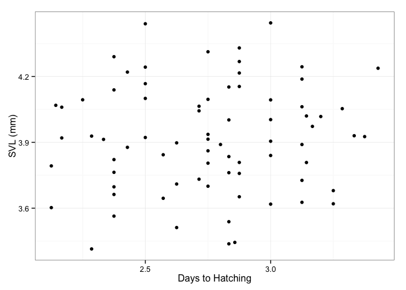

# Final Project
Claire Brumbaugh-Smith  
May 11, 2015  

This final project is a shiny app visualtization of thesis data gathered at Reed College 2014-2015. 
These files include the results of of ambient and maternal atrazine exposure on early amphibian growth and development, as well as a combined data set focusing on days to hatching, and SVL at hatching. 

The graph below shows the raw datapoints of SVL plotted againts days to hatching. 

 

Note that the `echo = FALSE` parameter was added to the code chunk to prevent printing of the R code that generated the plot.
